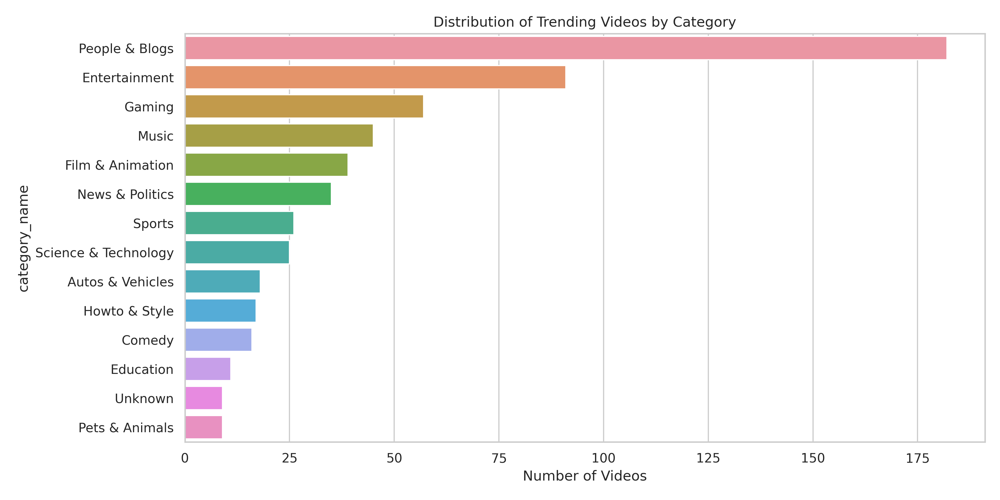
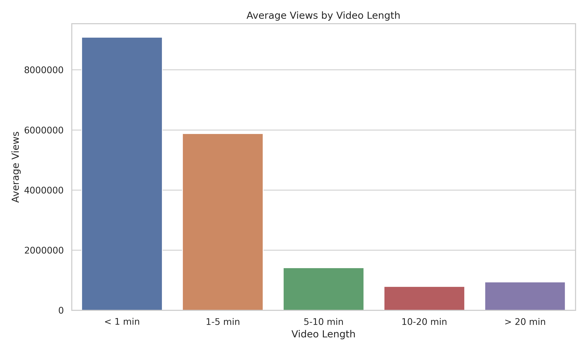
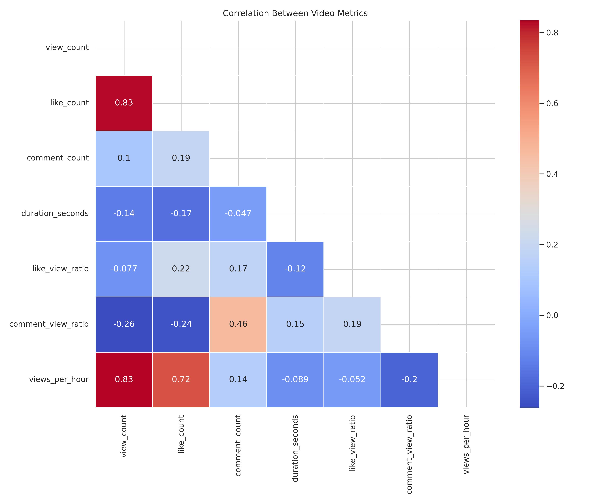
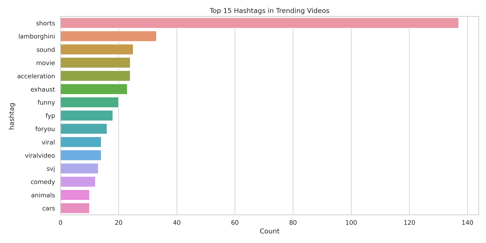
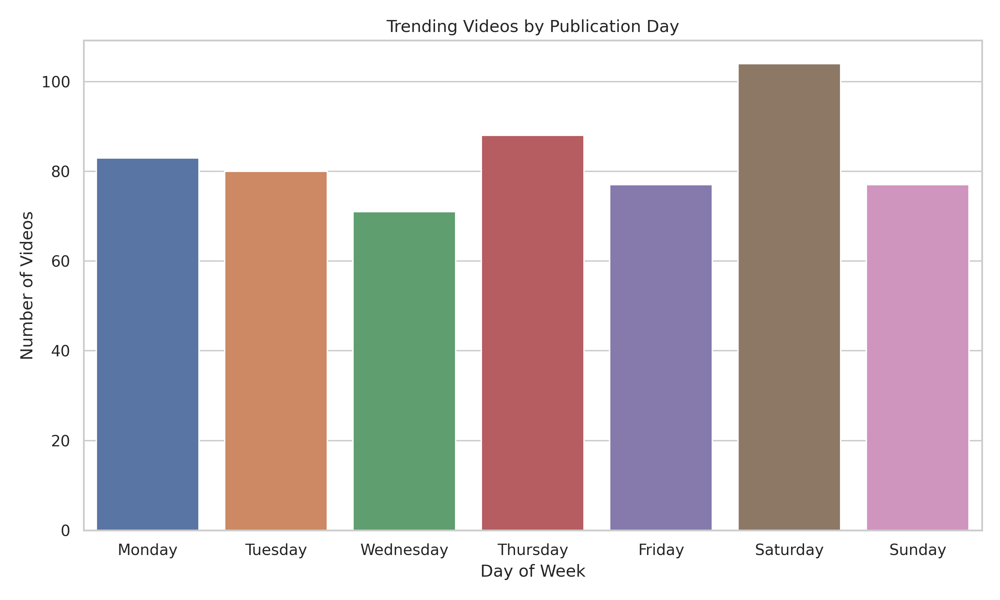

# YouTube Trending Videos Data Engineering Project


A comprehensive data engineering solution for extracting, processing, analyzing, and visualizing YouTube trending videos data with automated workflows and insightful analytics.

## Dashboard Showcase

<p align="center">
  
  <br>
  <em>Interactive dashboard showing real-time insights from YouTube trending videos data</em>
</p>

## Project Overview

This project creates an end-to-end data pipeline to collect trending videos from YouTube, process the data to extract meaningful insights, store it efficiently across multiple systems, and present the results through an interactive dashboard. The entire workflow is automated and scheduled using Apache Airflow, with integration to cloud storage via Amazon S3.

### Key Features

- **End-to-End ETL Pipeline**: Extract data from YouTube API, transform it to derive useful metrics, and load it into PostgreSQL and Amazon S3
- **Fully Automated Workflow**: Apache Airflow DAGs for scheduled data collection and processing
- **Advanced Video Analytics**: Identify trends, patterns, and engagement metrics across categories
- **Interactive Dashboard**: Visualize data with Plotly Dash with filtering and exploration capabilities
- **Cloud Integration**: Amazon S3 for reliable data storage and retrieval
- **Production-Ready Architecture**: Well-structured, maintainable, and extensible codebase

## Architecture

<p align="center">
  
  <br>
  <em>Data flow architecture from extraction to visualization</em>
</p>

### System Components

1. **Data Sources**:
   - YouTube Data API v3 for trending videos across multiple categories and regions

2. **Data Processing**:
   - Python-based ETL scripts for extraction, transformation, and loading
   - Apache Airflow for workflow orchestration and scheduling
   - Advanced analytics for engagement metrics and content optimization

3. **Storage**:
   - PostgreSQL/SQLite database for structured data and efficient queries
   - Amazon S3 for raw, processed, and analysis data using optimized formats

4. **Visualization**:
   - Plotly Dash for interactive dashboard with real-time filtering
   - Matplotlib/Seaborn for static visualizations and reports

## Dashboard Views

The interactive dashboard provides comprehensive analytics through multiple specialized views:

### Category Analysis
<p align="center">
  
  <br>
  <em>Distribution of trending videos across content categories, top hashtags, and leading channels</em>
</p>

### Content Analysis
<p align="center">
  
  <br>
  <em>Performance metrics by video attributes like length, publishing time, and format</em>
</p>

### Top Performers
<p align="center">
  
  <br>
  <em>Highest-ranking trending videos by engagement rates and visibility metrics</em>
</p>

## Visualizations & Insights

The project generates multiple visualization types to provide comprehensive insights:

| Visualization | Description |
|---------------|-------------|
|  | Breakdown of trending videos across content categories |
|  | Impact of video duration on view counts and engagement |
|  | Correlation between key metrics (views, likes, comments) |
|  | Most effective hashtags in trending videos |
|  | Optimal publishing days for maximizing visibility |

## Getting Started

### Prerequisites

- Python 3.8+
- PostgreSQL or SQLite
- AWS account (for S3 integration)
- YouTube Data API key

### Installation

1. Clone the repository:
   ```bash
   git clone https://github.com/yourusername/youtube-trending-analysis.git
   cd youtube-trending-analysis
   ```

2. Install dependencies:
   ```bash
   pip install -r requirements.txt
   ```

3. Set up environment variables:
   ```bash
   export YOUTUBE_API_KEY="your_youtube_api_key"
   export AWS_ACCESS_KEY_ID="your_aws_access_key"
   export AWS_SECRET_ACCESS_KEY="your_aws_secret_key"
   export DB_PASSWORD="your_database_password"
   ```

4. Update configuration in `config/config.yaml` with your specific settings

### Running the Pipeline

#### Using the Startup Script

The project includes a convenient startup script to run different components:

```bash
# Run the complete pipeline
./start.sh pipeline

# Start the dashboard only
./start.sh dashboard

# Start Airflow for scheduled execution
./start.sh airflow

# Start all components
./start.sh all

# Stop all running components
./start.sh stop
```

#### Manual Component Execution

You can also run individual components manually:

1. Extract data from YouTube API:
   ```bash
   python -m scripts.extract config/config.yaml
   ```

2. Transform the raw data:
   ```bash
   python -m scripts.transform config/config.yaml data/raw_data.pkl
   ```

3. Load data into storage systems:
   ```bash
   python -m scripts.load config/config.yaml data/raw_data.pkl data/processed_data.pkl
   ```

4. Generate analytics and visualizations:
   ```bash
   python -m scripts.analyze config/config.yaml data/processed_data.pkl
   ```

### Running the Dashboard

Start the Dash application:
```bash
python -m dashboard.app
```

Access the dashboard at `http://localhost:8050`

## Analytics Capabilities

The project provides comprehensive insights, including:

1. **Category Performance**: Identifies which video categories dominate the trending section
2. **Top Performers**: Videos with highest engagement and growth rates
3. **Channel Analysis**: Most successful channels in trending sections
4. **Content Optimization**: Ideal video length, publishing time, and format
5. **Engagement Patterns**: View-to-like ratios, comment rates, views per hour
6. **Hashtag Effectiveness**: Most successful hashtags and tags

## Project Structure

```
.
├── README.md                # Project documentation
├── requirements.txt         # Python dependencies
├── config/                  # Configuration files
├── dags/                    # Airflow DAGs
├── scripts/                 # Core processing scripts
│   ├── extract.py           # YouTube API data extraction
│   ├── transform.py         # Data transformation and feature engineering
│   ├── load.py              # Data loading to storage systems
│   └── analyze.py           # Data analysis and visualization
├── utils/                   # Utility modules
│   ├── s3_utils.py          # Amazon S3 operations
│   └── db_utils.py          # Database operations
├── dashboard/               # Dash web application
├── visualizations/          # Generated visualizations
└── tests/                   # Unit and integration tests
```

## Future Enhancements

- Natural Language Processing on video titles and descriptions
- Sentiment analysis of comments
- Machine learning models to predict trending potential
- Competitor analysis for channels
- Regional trend comparison

## Contributing

Contributions are welcome! Please feel free to submit a Pull Request.

## License

This project is licensed under the MIT License - see the LICENSE file for details.

## Technical Implementation Details

This project implements several advanced technical concepts:

- **Modular Data Pipeline**: Each component (extract, transform, load, analyze) operates independently
- **Data Transformation Pipeline**: Calculates derived metrics like engagement ratios and growth rates
- **Robust Error Handling**: Graceful fallbacks and detailed logging throughout the pipeline
- **Optimized Storage**: Parquet formats for efficient data storage and retrieval
- **Containerization-Ready**: Structure supports easy Docker deployment
- **Data Validation**: Schema verification and error handling at each pipeline stage

## Contact

For questions or feedback about this project, please reach out:
- Email: your.email@example.com
- GitHub: [Your GitHub Profile](https://github.com/yourusername)
- LinkedIn: [Your LinkedIn Profile](https://linkedin.com/in/yourusername)

---

<p align="center">
  <small>Built with Python, Airflow, and Plotly Dash</small>
</p>
